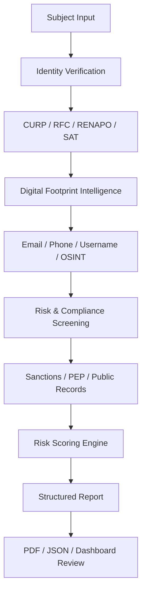
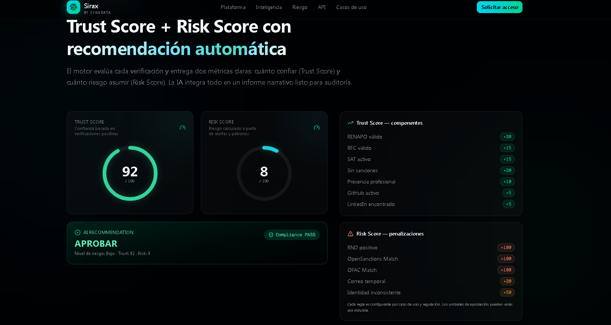
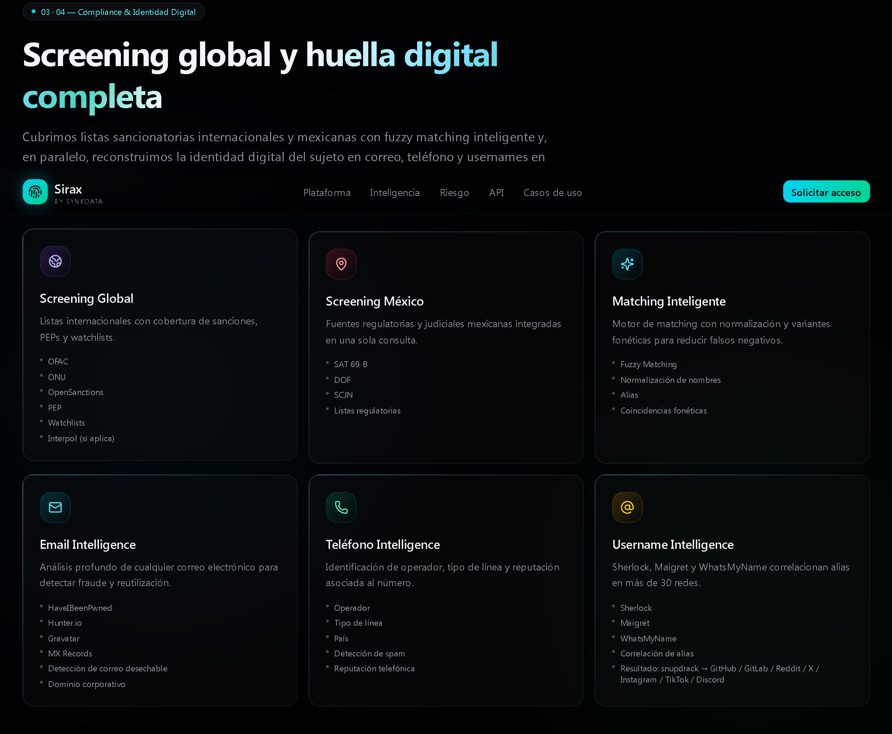
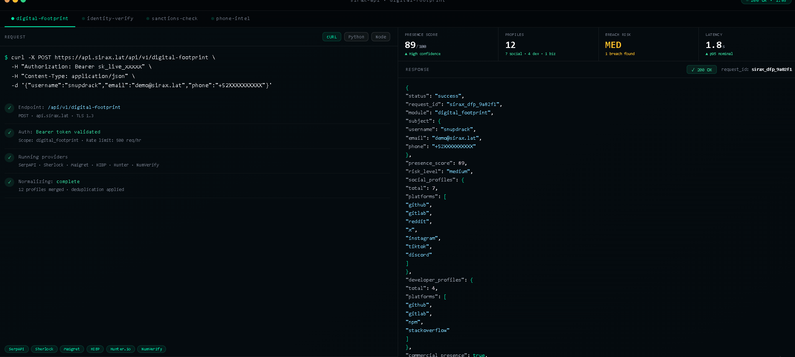

# SIRAX Platform

<p align="center">
  <video 
    src="./download/video1.mp4"
    width="100%"
    controls
    autoplay
    muted
    loop
    playsinline>
  </video>
</p>

<p align="center">
  
</p>

<p align="center">
  
</p>

<p align="center">
  <strong>Identity Verification · Risk Intelligence · Digital Footprint Analysis · Compliance Screening</strong>
</p>

<p align="center">
  <em>Know More. Risk Less.</em>
</p>

<p align="center">
  
  
  
  
</p>

<p align="center">
  <a href="https://landing.sirax.lat/" target="_blank">
    
  </a>
  <a href="https://github.com/JCesarGR/sirax-platform" target="_blank">
    
  </a>
</p>

---

## What is SIRAX?

**SIRAX** is an identity verification and risk intelligence platform designed to help organizations understand who they are evaluating, what risk signals exist, and how much digital exposure is associated with a person, company, account, email, phone number, or identity record.

The platform centralizes identity verification, digital footprint enrichment, provider orchestration, compliance screening, risk scoring, and structured reporting into one operational workflow.

SIRAX is built for environments where fragmented information is not enough. Instead of checking multiple services manually, the platform organizes data sources, normalizes provider responses, correlates signals, and converts raw findings into intelligence that can support verification, due diligence, onboarding, fraud prevention, compliance, and background review processes.

<p align="center">
  
</p>

<p align="center">
  <em>Unified identity, risk, and digital footprint intelligence from a single operational interface.</em>
</p>

---

## Core Vision

SIRAX was created around one central question:

> **How can an organization verify identity, detect risk, and understand digital exposure from one centralized platform?**

Most verification workflows are fragmented. One provider validates identity, another checks compliance lists, another enriches email data, another reviews phone information, and another performs open-source intelligence searches.

SIRAX brings these signals together into a modular intelligence layer.

```txt
Identity Data
   ↓
Official Validation
   ↓
Digital Footprint Enrichment
   ↓
Compliance & Risk Screening
   ↓
Provider Normalization
   ↓
Risk Scoring
   ↓
Structured Intelligence Report
```

---

## Platform Scope

SIRAX is designed to cover several layers of identity and risk intelligence.

| Layer                  | What SIRAX Covers                                                            |
| ---------------------- | ---------------------------------------------------------------------------- |
| Identity Verification  | CURP, RFC, RENAPO, SAT, identity validation and official record checks       |
| Digital Footprint      | Email, phone, username, social profiles, developer profiles, public exposure |
| Compliance Screening   | Sanctions, PEP indicators, public lists, risk signals and watchlist logic    |
| OSINT Enrichment       | Search intelligence, username discovery, public profile mapping and dorks    |
| Provider Orchestration | Modular integrations, fallbacks, provider status and normalized responses    |
| Risk Scoring           | Signal classification, confidence scoring and final risk summary             |
| Reporting              | Structured reports, evidence references, JSON output and PDF-ready summaries |

---

## Intelligence Workflow



<p align="center">
  
</p>

---

## Identity Verification

SIRAX supports structured identity verification workflows focused on Mexican identity and compliance needs.

The identity layer is designed to validate, normalize, and enrich personal or business records through official and provider-based sources.

### Capabilities

* CURP validation
* RFC validation
* RENAPO verification
* SAT verification
* Identity data normalization
* Format validation
* Provider-based verification
* Fallback provider support
* Validation status tracking
* Evidence-based verification results

SIRAX does not treat identity verification as a single API call. It treats it as a workflow where every provider response becomes part of a larger verification profile.

---

## Digital Footprint Intelligence

The digital footprint module helps identify public exposure connected to usernames, emails, phone numbers, and other subject identifiers.

This layer is useful for understanding whether a subject has a visible online presence, whether an email appears in risk-related sources, whether a username is reused across platforms, or whether phone and email metadata can enrich the verification profile.

<p align="center">
  
</p>

### Capabilities

* Email enrichment
* Phone enrichment
* Username discovery
* Public profile correlation
* Developer profile discovery
* Social profile discovery
* Search-based OSINT enrichment
* Breach exposure indicators
* Disposable email detection
* Commercial presence detection
* Multi-platform visibility mapping
* Digital exposure scoring

### Example Analysis Areas

| Input        | Possible Intelligence                                                  |
| ------------ | ---------------------------------------------------------------------- |
| Email        | Breach exposure, disposable status, domain type, reputation indicators |
| Phone        | Country, carrier, line type, risk indicators, spam signals             |
| Username     | Public profiles, reused handles, developer accounts, social presence   |
| CURP / RFC   | Identity consistency, official record validation, provider status      |
| Full profile | Risk correlation, confidence scoring and final report                  |

<p align="center">
  
</p>

---

## Risk & Compliance Screening

SIRAX can organize and evaluate risk signals from different compliance and public intelligence sources.

The goal is not only to find raw matches, but to classify them, normalize them, and present them in a way that is useful for operational decision-making.

### Risk Areas

* Sanctions indicators
* PEP-related indicators
* Public compliance list checks
* Public records
* Open-source intelligence findings
* Provider evidence tracking
* Risk categorization
* Confidence scoring
* Final risk summary

```txt
Raw Provider Data
   ↓
Signal Extraction
   ↓
Risk Classification
   ↓
Confidence Level
   ↓
Analyst-Ready Summary
```

<p align="center">
  
</p>

---

## Provider Orchestration

SIRAX was designed with a modular provider architecture. This allows the platform to connect multiple data providers without making the core verification workflow dependent on only one service.

Each provider can be enabled, disabled, replaced, or extended without breaking the full platform.

### Provider Categories

| Category              | Providers / Modules                        | Purpose                                          |
| --------------------- | ------------------------------------------ | ------------------------------------------------ |
| Identity Verification | CURP, RFC, RENAPO, SAT                     | Validate official identity records               |
| Government Signals    | IMSS, RND                                  | Enrich identity and background review            |
| Compliance            | OFAC, OpenSanctions, PEP indicators        | Detect sanctions, watchlists and risk signals    |
| Digital Footprint     | SerpAPI, Sherlock, Maigret                 | Discover public online presence                  |
| Email Intelligence    | HaveIBeenPwned, Hunter, Gravatar           | Analyze email exposure and reputation            |
| Phone Intelligence    | NumVerify, carrier lookup, spam indicators | Validate phone data and identify risk signals    |
| AI Reporting          | OpenAI, Gemini                             | Generate structured analyst-style summaries      |
| Fallback Providers    | Nubarium, APIMarket                        | Maintain continuity if a provider is unavailable |

---

## Why SIRAX is Different

SIRAX is not just a form, a dashboard, or a simple API wrapper.

It is designed as a complete verification and intelligence workflow.

| Difference                     | Value                                                            |
| ------------------------------ | ---------------------------------------------------------------- |
| Modular provider system        | New providers can be added without rebuilding the platform       |
| Mexico-focused verification    | Built around CURP, RFC, RENAPO, SAT and local verification needs |
| Digital footprint intelligence | Connects emails, phones, usernames and public profiles           |
| Provider fallback logic        | Keeps the workflow alive when one provider fails                 |
| Evidence-based reporting       | Every finding can be connected to a provider result              |
| Risk scoring                   | Converts multiple signals into a more readable risk profile      |
| Centralized dashboard          | Reduces manual review across disconnected tools                  |
| API-first approach             | Can serve internal systems, dashboards or external integrations  |
| Compliance-aware design        | Built for authorized verification and lawful use cases           |
| Scalable architecture          | Ready to expand into more providers, modules and reports         |

---

## System Status & Provider Health

SIRAX can expose a protected system status endpoint to verify which providers are active, disabled, or missing configuration.

This helps operators understand whether the platform is ready to run a full verification workflow.

```txt
GET /api/system/status
```

Example response:

```json
{
  "providers": {
    "serpapi": "enabled",
    "hunter": "enabled",
    "numverify": "missing_api_key",
    "apimarket": "enabled",
    "nubarium": "disabled",
    "opensanctions": "enabled",
    "ai_report": "enabled"
  }
}
```

<p align="center">
  
</p>

---

## Report Generation

SIRAX transforms provider responses into structured reports that can support review, documentation and decision-making.

Report outputs may include:

* Identity summary
* Provider results
* Digital footprint summary
* Risk indicators
* Confidence score
* Evidence references
* Final analyst summary
* JSON export
* PDF-ready report structure

### Example Report Structure

```json
{
  "status": "success",
  "verification_id": "sirax_ver_2f81a0",
  "identity": {
    "curp_valid": true,
    "rfc_valid": true,
    "identity_score": 94
  },
  "digital_footprint": {
    "presence_score": 89,
    "profiles_found": 12,
    "developer_profiles": 4
  },
  "risk": {
    "risk_score": 8,
    "risk_level": "low",
    "flags": []
  },
  "report": {
    "format": ["json", "pdf"],
    "status": "ready"
  }
}
```

---

## Architecture Overview

```txt
SIRAX Platform
├── Identity Verification
│   ├── CURP
│   ├── RFC
│   ├── RENAPO
│   ├── SAT
│   └── APIMarket / Nubarium Fallbacks
│
├── Digital Footprint Intelligence
│   ├── Email Enrichment
│   ├── Phone Enrichment
│   ├── Username Discovery
│   ├── Search Intelligence
│   ├── SerpAPI Dorks
│   ├── Sherlock
│   └── Maigret
│
├── Risk & Compliance
│   ├── OFAC
│   ├── OpenSanctions
│   ├── PEP Indicators
│   ├── Public Records
│   └── Risk Signals
│
├── Provider Registry
│   ├── Status Check
│   ├── Required ENV Vars
│   ├── Fallback Logic
│   └── Normalized Responses
│
└── Reporting Engine
    ├── Evidence Summary
    ├── Risk Summary
    ├── Provider Results
    ├── AI Analyst Summary
    └── Final Report
```

---

## API-Ready Design

SIRAX is designed to work as both a dashboard and an API-driven intelligence layer.

Example identity verification request:

```bash
curl --request POST "$SIRAX_API_URL/api/v1/identity/verify" \
  --header "Authorization: Bearer $SIRAX_API_KEY" \
  --header "Content-Type: application/json" \
  --data '{
    "curp": "XXXX000000XXXXXX00",
    "rfc": "XXXX000000XXX",
    "email": "demo@sirax.lat",
    "phone": "+52XXXXXXXXXX",
    "include_digital_footprint": true,
    "include_compliance_screening": true
  }'
```

Example digital footprint request:

```bash
curl --request POST "$SIRAX_API_URL/api/v1/digital-footprint" \
  --header "Authorization: Bearer $SIRAX_API_KEY" \
  --header "Content-Type: application/json" \
  --data '{
    "username": "demo_user",
    "email": "demo@sirax.lat",
    "phone": "+52XXXXXXXXXX"
  }'
```

---

## Security & Responsible Use

SIRAX is designed for authorized verification, compliance, fraud prevention, due diligence and operational risk intelligence workflows.

The platform should only be used with lawful basis, proper authorization, user consent where required, and in accordance with applicable privacy, data protection and compliance regulations.

This project does not encourage unauthorized surveillance, credential abuse, account intrusion, unauthorized access, harassment, or misuse of third-party systems.

Before deploying or publishing a repository based on this project:

* Do not commit `.env` files
* Do not expose API keys
* Do not publish real personal data
* Do not commit generated reports with sensitive information
* Do not expose raw provider responses publicly
* Validate and sanitize all provider responses
* Use HTTPS in production
* Restrict admin routes
* Apply rate limits to public endpoints
* Rotate any key that was previously exposed

---

## Strategic Roadmap

* [ ] Provider health dashboard
* [ ] Advanced report builder
* [ ] Role-based access control
* [ ] Audit logs
* [ ] Risk scoring engine
* [ ] PDF report export
* [ ] Webhook support
* [ ] Multi-tenant support
* [ ] Admin analytics panel
* [ ] Expanded digital footprint intelligence module
* [ ] API terminal preview inside dashboard
* [ ] AI-assisted analyst report
* [ ] Provider latency monitoring
* [ ] Evidence-based reporting engine
* [ ] Additional fallback providers for CURP/RFC validation

---

## Brand

**SIRAX**
Identity & Risk Intelligence Platform

**Know More. Risk Less.**

Developed by **Synkdata Technologies**.

---

## Author

**Julio Cesar Rios Garcia**
Founder, Synkdata Technologies

GitHub: [@JCesarGR](https://github.com/JCesarGR)
Portfolio: [synkdata.online](https://synkdata.online)
Landing: [landing.sirax.lat](https://landing.sirax.lat/)

---

## License

This project is proprietary software.

All rights reserved. Unauthorized copying, distribution, modification, or commercial use of this software is strictly prohibited without prior written permission.
