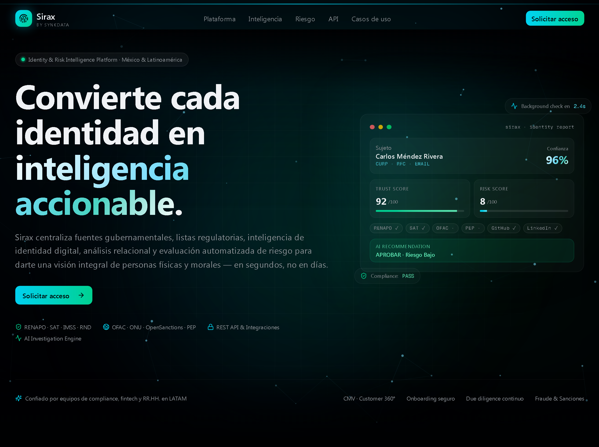
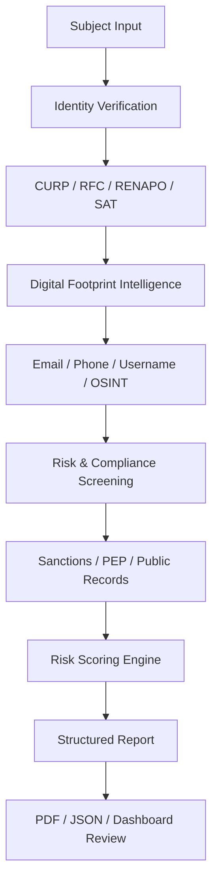

# SIRAX Platform

<p align="center">
  
</p>

<p align="center">
  
</p>

<p align="center">
  <strong>Identity Verification · Risk Intelligence · Digital Footprint Analysis · Compliance Screening</strong>
</p>

<p align="center">
  <em>Know More. Risk Less.</em>
</p>

<p align="center">
  
  
  
  
</p>

<p align="center">
  <a href="https://landing.sirax.lat/" target="_blank">
    
  </a>
  <a href="https://github.com/JCesarGR/sirax-platform" target="_blank">
    
  </a>
</p>

---

## What is SIRAX?

**SIRAX** is an identity verification and risk intelligence platform designed to centralize multiple data sources into a single professional verification workflow.

The platform helps analyze identity data, validate official records, enrich digital footprints, identify risk indicators, and generate structured reports for compliance, due diligence, background verification, and operational risk analysis.

SIRAX was built with a modular provider architecture, allowing identity, OSINT, compliance, enrichment, and reporting modules to work together without breaking the main verification flow.

---

## Product Experience

<p align="center">
  
</p>

<p align="center">
  <em>Unified identity, risk, and digital footprint intelligence from a single operational interface.</em>
</p>

---

## API Terminal Preview

<p align="center">
  
</p>

Example API request:

```bash
curl --request POST "$SIRAX_API_URL/api/v1/digital-footprint" \
  --header "Authorization: Bearer $SIRAX_API_KEY" \
  --header "Content-Type: application/json" \
  --data '{
    "username": "demo_user",
    "email": "demo@sirax.lat",
    "phone": "+52XXXXXXXXXX"
  }'
```

Example normalized response:

```json
{
  "status": "success",
  "request_id": "sirax_dfp_9a82f1",
  "latency": "1.8s",
  "module": "digital_footprint",
  "result": {
    "username": "demo_user",
    "presence_score": 89,
    "social_profiles": 12,
    "developer_profiles": 4,
    "commercial_presence": true,
    "platforms": [
      "github",
      "gitlab",
      "reddit",
      "x",
      "instagram",
      "tiktok",
      "discord"
    ],
    "email_intelligence": {
      "disposable": false,
      "breached": true,
      "corporate_domain": true
    },
    "phone_intelligence": {
      "carrier": "Telcel",
      "line_type": "mobile",
      "spam_reports": 0
    }
  }
}
```

---

## Core Purpose

SIRAX answers a critical question:

> **How can an organization verify identity, detect risk, and understand digital exposure from one centralized platform?**

Instead of checking multiple providers manually, SIRAX organizes the process into one unified flow:

```txt
Input Data
   ↓
Identity Validation
   ↓
Digital Footprint Enrichment
   ↓
Risk & Compliance Screening
   ↓
Provider Normalization
   ↓
Structured Report
```

---

## Intelligence Workflow



---

## Main Capabilities

### Identity Verification

SIRAX supports structured identity verification workflows focused on Mexican identity data.

Key capabilities include:

* CURP validation
* RFC validation
* RENAPO verification
* SAT verification
* Identity data normalization
* Provider-based verification
* Official data source integration
* Fallback provider support
* Validation status tracking

---

### Digital Footprint Intelligence

SIRAX includes a digital footprint module designed to enrich a subject profile using configured, authorized, and public data sources.

Supported analysis areas include:

* Email enrichment
* Phone enrichment
* Username discovery
* Public profile correlation
* Breach exposure indicators
* Search-based OSINT enrichment
* Social profile discovery
* Developer profile discovery
* Commercial presence detection
* Multi-provider aggregation
* Digital exposure mapping

---

### Risk & Compliance Screening
<p align="center">
  
</p>
The platform can organize and evaluate risk signals from multiple sources.

Risk intelligence areas include:

* Sanctions indicators
* PEP-related indicators
* Public compliance list checks
* Open-source intelligence findings
* Provider evidence tracking
* Risk categorization
* Confidence scoring
* Final risk summary

---

### Report Generation

SIRAX consolidates provider results into structured reports that can be used for review, documentation, and decision-making.

Report outputs may include:

* Identity summary
* Provider results
* Digital footprint summary
* Risk indicators
* Confidence score
* Evidence references
* Final analyst summary
* JSON export
* PDF-ready report structure

---

## Provider Orchestration

SIRAX was designed to work with multiple external providers through a modular architecture.

Potential provider categories include:

* Identity providers
* Government validation providers
* OSINT providers
* Search intelligence providers
* Email enrichment providers
* Phone enrichment providers
* Compliance screening providers
* AI-assisted report providers

---

## Provider Matrix

| Category              | Providers / Modules                        | Purpose                                                 |
| --------------------- | ------------------------------------------ | ------------------------------------------------------- |
| Identity Verification | CURP, RFC, RENAPO, SAT                     | Validate identity and official records                  |
| Government Signals    | IMSS, RND                                  | Enrich verification with public or authorized sources   |
| Compliance            | OFAC, OpenSanctions, PEP indicators        | Detect sanctions, watchlist, and risk signals           |
| Digital Footprint     | SerpAPI, Sherlock, Maigret                 | Discover public online presence                         |
| Email Intelligence    | HaveIBeenPwned, Hunter, Gravatar           | Analyze email exposure and reputation                   |
| Phone Intelligence    | NumVerify, carrier lookup, spam indicators | Validate phone data and risk signals                    |
| AI Reporting          | OpenAI, Gemini                             | Generate structured summaries and analyst-style reports |
| Fallback Providers    | Nubarium, APIMarket                        | Maintain continuity when a provider is unavailable      |

---

## Why SIRAX is Different

SIRAX is not just a form or a simple API wrapper.

It is designed as a complete verification workflow.

| Feature                        | Value                                                   |
| ------------------------------ | ------------------------------------------------------- |
| Modular providers              | Add or replace providers without breaking the system    |
| Centralized workflow           | One place for identity, risk, OSINT, and reporting      |
| Provider status control        | Know which modules are active or missing configuration  |
| Structured reports             | Turn raw provider data into useful intelligence         |
| Fallback logic                 | Continue operating when a provider is unavailable       |
| Mexico-focused validation      | Built around real identity verification needs           |
| Digital footprint intelligence | Connects usernames, emails, phones, and public profiles |
| Risk scoring                   | Organizes signals into a clear operational score        |
| Scalable architecture          | Ready to expand with new modules and providers          |

---

## Architecture

```txt
SIRAX Platform
├── Identity Verification
│   ├── CURP
│   ├── RFC
│   ├── RENAPO
│   ├── SAT
│   └── APIMarket / Nubarium Fallbacks
│
├── Digital Footprint Intelligence
│   ├── Email Enrichment
│   ├── Phone Enrichment
│   ├── Username Discovery
│   ├── Search Intelligence
│   ├── SerpAPI Dorks
│   ├── Sherlock
│   └── Maigret
│
├── Risk & Compliance
│   ├── OFAC
│   ├── OpenSanctions
│   ├── PEP Indicators
│   ├── Public Records
│   └── Risk Signals
│
├── Provider Registry
│   ├── Status Check
│   ├── Required ENV Vars
│   ├── Fallback Logic
│   └── Normalized Responses
│
└── Reporting Engine
    ├── Evidence Summary
    ├── Risk Summary
    ├── Provider Results
    ├── AI Analyst Summary
    └── Final Report
```

---

## Suggested Project Structure

```txt
src/
├── app/
├── components/
│   ├── dashboard/
│   ├── reports/
│   ├── forms/
│   ├── terminal/
│   └── ui/
├── lib/
│   ├── providers/
│   │   ├── identity/
│   │   ├── osint/
│   │   ├── compliance/
│   │   ├── enrichment/
│   │   └── registry.ts
│   ├── services/
│   ├── validators/
│   └── utils/
├── public/
├── download/
│   ├── sirax-hero.png
│   ├── animacion1.gif
│   └── animacion2.gif
└── styles/
```

---

## Provider Registry

SIRAX uses a provider registry to centralize external integrations and safely check which services are enabled.

Each provider can define:

* Provider name
* Required environment variables
* Enabled or disabled status
* Request logic
* Error handling
* Timeout handling
* Normalized response structure
* Fallback behavior

Example:

```ts
export const provider = {
  name: "ProviderName",
  enabled: Boolean(process.env.PROVIDER_API_KEY),
  requiredEnv: ["PROVIDER_API_KEY"],
};
```

---

## System Status

SIRAX can expose a protected endpoint to verify provider configuration without exposing secrets.
<p align="center">
  
</p>
```txt
GET /api/system/status
```

Example response:

```json
{
  "providers": {
    "serpapi": "enabled",
    "hunter": "enabled",
    "numverify": "missing_api_key",
    "apimarket": "enabled",
    "nubarium": "disabled",
    "opensanctions": "enabled",
    "ai_report": "enabled"
  }
}
```

---

## Environment Variables

Create a `.env` file based on `.env.example`.

```env
DATABASE_URL=
JWT_SECRET=

SIRAX_API_URL=
SIRAX_API_KEY=

OPENAI_API_KEY=
GEMINI_API_KEY=

SERPAPI_API_KEY=
HIBP_API_KEY=
HUNTER_API_KEY=
NUMVERIFY_API_KEY=

NUBARIUM_API_KEY=
APIMARKET_API_KEY=

SMTP_HOST=
SMTP_PORT=
SMTP_USER=
SMTP_PASS=
```

Never commit real credentials to the repository.

---

## Installation

Clone the repository:

```bash
git clone https://github.com/JCesarGR/sirax-platform.git
cd sirax-platform
```

Install dependencies:

```bash
npm install
```

Run development server:

```bash
npm run dev
```

Build for production:

```bash
npm run build
```

Start production mode:

```bash
npm start
```

---

## Recommended Workflow

```bash
git checkout -b feature/new-module
npm run dev
npm run build
git add .
git commit -m "feat: add new module"
git push origin feature/new-module
```

---

## API Example

```bash
curl --request POST "$SIRAX_API_URL/api/v1/identity/verify" \
  --header "Authorization: Bearer $SIRAX_API_KEY" \
  --header "Content-Type: application/json" \
  --data '{
    "curp": "XXXX000000XXXXXX00",
    "rfc": "XXXX000000XXX",
    "email": "demo@sirax.lat",
    "phone": "+52XXXXXXXXXX",
    "include_digital_footprint": true,
    "include_compliance_screening": true
  }'
```

Example response:

```json
{
  "status": "success",
  "verification_id": "sirax_ver_2f81a0",
  "identity": {
    "curp_valid": true,
    "rfc_valid": true,
    "identity_score": 94
  },
  "digital_footprint": {
    "presence_score": 89,
    "profiles_found": 12,
    "developer_profiles": 4
  },
  "risk": {
    "risk_score": 8,
    "risk_level": "low",
    "flags": []
  },
  "report": {
    "format": ["json", "pdf"],
    "status": "ready"
  }
}
```

---

## Security Guidelines

Before deploying or publishing this repository:

* Do not commit `.env` files
* Do not expose API keys
* Do not commit generated reports with real personal data
* Do not commit database dumps
* Do not expose raw provider responses publicly
* Validate and sanitize all external provider responses
* Use HTTPS in production
* Restrict admin routes
* Apply rate limits to public endpoints
* Rotate any key that was previously exposed

If a secret was ever committed, deleting it from the current code is not enough. The key must be rotated and the Git history should be cleaned before making the repository public.

---

## Compliance Notice

SIRAX is designed for authorized verification, compliance, and risk intelligence workflows.

The platform should only be used with lawful basis, user consent where required, and in accordance with applicable privacy, data protection, and compliance regulations.

This project does not encourage unauthorized surveillance, credential abuse, account intrusion, unauthorized access, or misuse of third-party systems.

---

## Roadmap

* [ ] Provider health dashboard
* [ ] Advanced report builder
* [ ] Role-based access control
* [ ] Audit logs
* [ ] Risk scoring engine
* [ ] PDF report export
* [ ] Webhook support
* [ ] Multi-tenant support
* [ ] Admin analytics panel
* [ ] Additional fallback providers for CURP/RFC validation
* [ ] Expanded digital footprint intelligence module
* [ ] API terminal preview inside dashboard
* [ ] AI-assisted analyst report
* [ ] Provider latency monitoring
* [ ] Evidence-based reporting engine

---

## Brand

**SIRAX**
Identity & Risk Intelligence Platform

**Know More. Risk Less.**

Developed by **Synkdata Technologies**.

---

## Author

**Julio Cesar Rios Garcia**
Founder, Synkdata Technologies

GitHub: [@JCesarGR](https://github.com/JCesarGR)
Portfolio: [synkdata.online](https://synkdata.online)
Landing: [landing.sirax.lat](https://landing.sirax.lat/)

---

## License

This project is proprietary software.

All rights reserved. Unauthorized copying, distribution, modification, or commercial use of this software is strictly prohibited without prior written permission.
